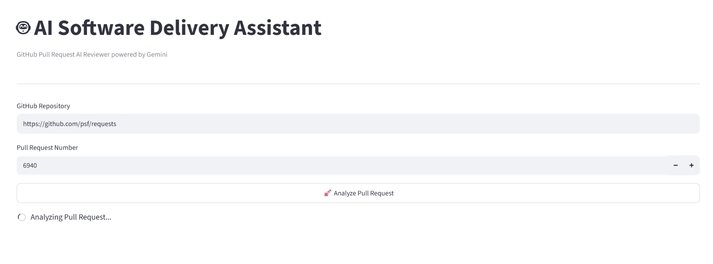
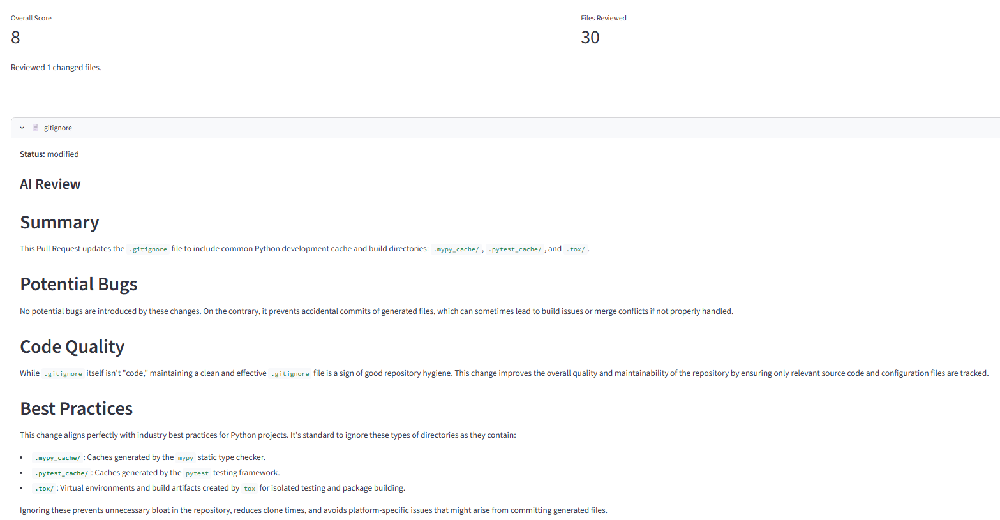

# 🤖 AI Pull Request Reviewer

An AI-powered Pull Request Review Assistant that analyzes GitHub Pull Requests using **Google Gemini**, **FastAPI**, and **Streamlit**.

The application retrieves the changed files from a GitHub Pull Request, extracts the code diff, and generates intelligent code review suggestions using a Large Language Model (LLM).

This project demonstrates how modern AI can assist software engineering workflows by automating code review, identifying potential issues, and suggesting best practices.

---

## 📸 Screenshots

### Main Dashboard



### Review Summary



---

# ✨ Features

- 🤖 AI-powered Pull Request Reviews using Google Gemini
- 📂 Analyze GitHub Pull Requests
- 📝 Reviews only the changed code (Git Diff)
- 🚀 FastAPI backend
- 🎨 Interactive Streamlit dashboard
- 🔐 Environment variable support
- 📊 Pull Request summary and review score
- ⚡ Modular architecture
- 📦 Clean service-oriented codebase
- 💬 Markdown-based AI responses

---

# 🏗 Architecture

```text
                  GitHub Pull Request
                           │
                           ▼
                  GitHub REST API
                           │
                           ▼
                Changed Files (Diff/Patch)
                           │
                           ▼
                  Review Service (FastAPI)
                           │
                           ▼
                Gemini 2.5 Flash LLM
                           │
                           ▼
                  AI Review Generation
                           │
                           ▼
                 Streamlit Dashboard
```

---

# 🛠 Tech Stack

### Backend

- FastAPI
- Uvicorn
- Python

### Frontend

- Streamlit

### AI

- Google Gemini 2.5 Flash

### APIs

- GitHub REST API

### Libraries

- httpx
- pydantic
- python-dotenv
- google-genai

---

# 📁 Project Structure

```text
ai-pull-request-reviewer/
│
├── app/
│   ├── api/
│   ├── core/
│   ├── llm/
│   ├── models/
│   ├── services/
│   ├── utils/
│   └── main.py
│
├── streamlit_app/
│   └── app.py
│
├── .env
├── requirements.txt
└── README.md
```

---

# 🚀 How It Works

1. User enters a GitHub repository URL and Pull Request number.
2. FastAPI calls the GitHub Pull Request Files API.
3. The changed code (Git Diff) is extracted.
4. The Git Diff is sent to Google Gemini.
5. Gemini generates an AI code review.
6. Streamlit displays the review and overall summary.

---

# ⚙️ Installation

Clone the repository

```bash
git clone https://github.com/your-username/ai-pull-request-reviewer.git
```

Move into the project

```bash
cd ai-pull-request-reviewer
```

Create a virtual environment

```bash
python -m venv .venv
```

Activate the environment

### Windows

```powershell
.\.venv\Scripts\Activate.ps1
```

Install dependencies

```bash
pip install -r requirements.txt
```

---

# 🔑 Environment Variables

Create a `.env` file.

```env
GEMINI_API_KEY=your_gemini_api_key

GITHUB_TOKEN=your_github_personal_access_token
```

The GitHub token is optional for public repositories but recommended to avoid API rate limits.

---

# ▶️ Run the Backend

```bash
uvicorn app.main:app --reload
```

Backend URL

```
http://127.0.0.1:8000
```

Swagger

```
http://127.0.0.1:8000/docs
```

---

# ▶️ Run the Frontend

```bash
streamlit run streamlit_app/app.py
```

Open

```
http://localhost:8501
```

---

# 📋 Example

Repository

```
https://github.com/psf/requests
```

Pull Request

```
6940
```

The application will:

- Retrieve the Pull Request
- Extract changed code
- Generate an AI review
- Display recommendations in Streamlit

---

# 💡 Current Capabilities

- Pull Request analysis
- Git Diff parsing
- AI-generated code review
- Overall review summary
- Professional web dashboard

---

# 🔮 Future Improvements

- MCP (Model Context Protocol) Server
- Multi-Agent AI Review System
- Security Review Agent
- Performance Review Agent
- Unit Test Generation
- Automatic Review Comments on GitHub
- Review History
- Docker Deployment
- CI/CD Pipeline
- Multi-LLM Support (Gemini, OpenAI, Claude)

---

